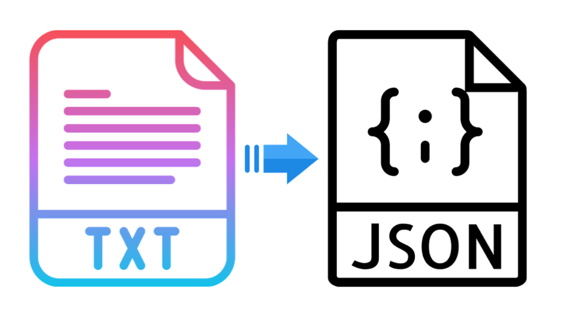

<h1 align="center">txt-file-to-json</h1>

<div align="center">

Reads a text file or data variable having a table and returns an array of obects. In which each object consists of all headers as keys and there data as values.

</div>

## Installation

```
npm i --save txt-file-to-json
```

## Usage

`txt-file-to-json` support CommonJS.

### In module system

Use `filePath` key to provide `TEXT data from file`.

```javascript
const txtToJson = require("txt-file-to-json");
const dataInJSON = txtToJSON({ filePath: "./filePath.txt" });
```

Use `data` key to provide `TEXT data from variable or directly`.

```javascript
const txtToJSON = require("txt-file-to-json");
const dataInJSON = txtToJSON({ data: someTEXTData });
```

#### Sample input (txt data) :

```
FIRST_NAME     LAST_NAME        NUMBER               EMAIL                        ADDRESS
Debra          Burks            880012XXXX           debra.burks@yahoo.com        9273 Thome Ave., `Orchard Park`, NY - 14127
Kasha          Todd             null                 kasha.todd@yahoo.com         910, Vine Street!!!, (Campbell), CA - 95008
Tameka         Fisher           880111XXXX           null                         7693 ~ Honey Creek St., Redondo Beach, "CA"      90278
```

#### Sample output (json data) :

```
[
  {
    FIRST_NAME: 'Debra',
    LAST_NAME: 'Burks',
    NUMBER: '880012XXXX',
    EMAIL: 'debra.burks@yahoo.com',
    ADDRESS: '9273 Thome Ave., `Orchard Park`, NY - 14127'
  },
  {
    FIRST_NAME: 'Kasha',
    LAST_NAME: 'Todd',
    NUMBER: null,
    EMAIL: 'kasha.todd@yahoo.com',
    ADDRESS: '910, Vine Street!!!, (Campbell), CA - 95008'
  },
  {
    FIRST_NAME: 'Tameka',
    LAST_NAME: 'Fisher',
    NUMBER: '880111XXXX',
    EMAIL: null,
    ADDRESS: '7693 ~ Honey Creek St., Redondo Beach, "CA"      90278'
  }
]
```

Use `noOfRecords` key along with `filePath` or `data` key to get data of `specific number of rows`.

```javascript
const txtToJson = require("txt-file-to-json");
const dataInJSON = txtToJSON({ filePath: "./filePath.txt", noOfRecords: 1 });
```

#### Sample output when `noOfRecords` is `1` (json data) :

```
[
  {
    FIRST_NAME: 'Debra',
    LAST_NAME: 'Burks',
    NUMBER: '880012XXXX',
    EMAIL: 'debra.burks@yahoo.com',
    ADDRESS: '9273 Thome Ave., `Orchard Park`, NY - 14127'
  }
]
```

# References
* To convert text and csv both to json. Try - "https://www.npmjs.com/package/data-to-json"
* To convert only csv data to json. Try - "https://www.npmjs.com/package/csv-file-to-json"
